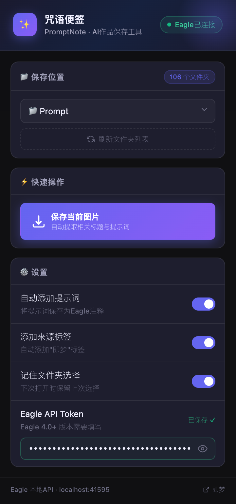

# 🦅 咒语便签 (PromptNote)

一款收集即梦图片提示词至 Eagle图库管理软件的浏览器扩展插件。支持 Chrome & Edge。



---

## 📁 项目结构

```
jimeng-eagle-extension/
├── manifest.json          # 扩展配置（Manifest V3）
├── icons/                 # 扩展图标（16/32/48/128px）
├── background/
│   └── background.js      # Service Worker（网络拦截、文件夹获取代理）
├── content/
│   ├── content.js         # 核心脚本（注入画廊按钮、提取数据）
│   └── content.css        # 注入按钮样式
└── popup/
    ├── popup.html         # 弹出窗口 UI
    └── popup.js           # 弹出窗口主逻辑（请求 Eagle API）
```

---

## 🚀 安装方法（开发者模式）

### Edge
1. 打开 `edge://extensions/`
2. 开启左下角**开发者模式**  
3. 点击**加载解压缩的扩展**
4. 选择本插件的文件夹

### Chrome
1. 打开 `chrome://extensions/`
2. 开启右上角**开发者模式**
3. 点击**加载已解压的扩展程序**
4. 选择本插件的文件夹
5. 

> [!IMPORTANT]
> 使用前必须先打开 Eagle 软件，Eagle 会在本地启动 API 服务（端口 41595）

---

## 🎯 使用方法

首次使用 Eagle 4.0 以上版本，需要在设置里填入你的 **Eagle API Token**

### 方式一：悬浮保存按钮（推荐）
- 在即梦首页点击图片进入某张**作品详情页**
- 鼠标悬浮在图片上即可看到左上角飘升的紫色 `添加咒语` 按钮
- 点击即可提取标题和图片对应的生成提示词，并同步保存至 Eagle

### 方式二：弹出面板操作
- 点击浏览器工具栏的插件图标
- 在弹出面板中：
  - 点击 **保存当前图片** 即可保存正在查看的首图

---

## ⚙️ 功能设置

| 设置项 | 说明 | 默认值 |
|--------|------|--------|
| 自动添加提示词 | 将图片提示词写入 Eagle 注释字段 | ✅ 开启 |
| 添加来源标签 | 自动添加"即梦""PromptNote""AI生成"标签 | ✅ 开启 |
| 记住文件夹选择 | 下次打开记住上次选择的 Eagle 分类位置 | ✅ 开启 |
| Eagle API Token | Eagle 4.0 拦截机制下的高阶保护设置 | 默认为空 |

---

## ❓ 常见问题

**Q: Eagle 状态显示"未连接"？**  
→ 请先启动本地电脑里的 Eagle 软件，它会自动开启本地服务允许插件接入。

**Q: 点击保存怎么报错 "failed to fetch"、有不支持的字符？**  
→ 请检查你填写的 Token 框里是否存在回车符或中文字符，当前版本会自动过滤。

**Q: 在首页列表点“添加咒语”获取不到正确的提示词？**  
→ 即梦首页的图片瀑布流为加速渲染，并未在前端塞入提示词参数。如需保留咒语，请完整点进作品详情页再保存。
